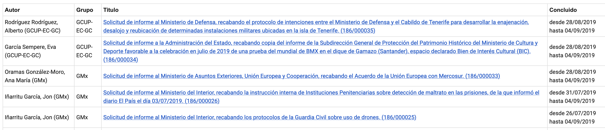
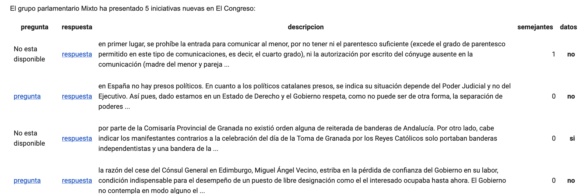

# Buceando en las cloacas con Python

---

## Sobre Civio

- Periodismo, incidencia, tecnología y litigación en aras de mayor transparencia

- Algunas cosas periodísticas que se nos dan bien:
  - La cobertura del BOE en [El Boe Nuestro de Cada Día](https://civio.es/el-boe-nuestro-de-cada-dia/)
  - [Temas de contratación](https://civio.es/area/contratacion/)
  - Aplicaciónes de servicio público ([bono social](https://civio.es/bono-social/) y [de las ayudas por la crisis del Coronavirus](https://civio.es/ayudas-sociales-coronavirus/) y [el indultómetro](https://civio.es/el-indultometro/))

[Premio Rey de España al Medio de Iberoamérica 2022 🥳](https://civio.es/novedades/2022/03/03/premio-rey-espana-efe-civio/)

---

## Programación _back-end_ en un medio de comunicación

_Scripts_ sencillos ejecutados en el terminal para temas rápidos. Programas más complejos para temas de más recorrido como los [temas de contratación](https://civio.es/area/contratacion/).

- Rascar data de HTML y PDF ([requests.py](https://docs.python-requests.org/en/latest/), [bs4.py](https://pypi.org/project/bs4/), [selenium.py](https://www.selenium.dev/), PyPDF) una sola vez, o durante un período de tiempo concreto.

- Análisis de grandes _datasets_ ([pandas.py](https://pandas.pydata.org/))

- Aplicaciones de apoyo a periodistas

---

## Web scraping en investigaciones largas en Civio 🔎

[De 25 céntimos a 8 euros por una mascarilla, la guerra de precios que se saldó con millones de euros para los intermediarios](https://civio.es/quien-cobra-la-obra/2021/03/24/precios-unitarios-mascarillas/). Datos de la [Plataforma de contratación](https://www.hacienda.gob.es/es-ES/GobiernoAbierto/Datos%20Abiertos/Paginas/licitaciones_plataforma_contratacion.aspx)

- 16.589 contratos firmados por todas las administraciones públicas (6.445 millones de euros) 

- Algunos ayuntamientos se desembolsaron más de cien euros por una garrafa de cinco litros de gel hidroalcohólico

---

## Usando Python para rascar datos periódicamente en Civio

### [La movilidad europea en tiempos de coronavirus](https://civio.es/covid-movilidad-europea/) 

_Scraping_ recurrente de tres fuentes de datos:

- Cámaras de tráfico
- Informes de movilidad de Apple (diario)
- Tomtom (cada hora)

---

## Investigaciones a largo plazo en El Confidencial (Python)

[Metro inaccesible](https://www.elconfidencial.com/espana/madrid/2019-09-06/metro-accesible-paradas-ascensor-escaleras_2209007/). Datos obtenidos gracias a un rascado diario de la web de [incidencias del metro](https://www.metromadrid.es/es/linea/) 

- Siete de cada diez paradas de la red son accesibles. La mayoría de ellas están alejadas del centro

- Entre el 3 de junio y el 18 de julio, se detectaron 204 estaciones reportando al menos una incidencia en las escaleras y otras 150 estaciones, en ascensores

---

[Más público que Netflix y miles de reseñas de puteros: así es el gran barrio rojo 'online'](https://www.elconfidencial.com/tecnologia/2018-09-25/prostitucion-anuncios-portales-pasion-mileroticos_1620413/)

Datos obtenidos gracias a un rascado de los portales [Slumi](https://www.slumi.com/escorts/madrid), [pasion.com](https://www.pasion.com/contactos-mujeres/mileroticos.htm) y [mileroticos](https://www.mileroticos.com/).

- En torno al 35% de los teléfonos corresponden a más de un anuncio

---

[¿De qué año es tu casa? El mapa que muestra cómo se ha construido España](https://www.elconfidencial.com/vivienda/2019-11-26/mapa-espana-urbanismo-edificios-historia_2348415/). Datos obtenidos del catastro y fusionados en una capa GEOJSON mediante `geopandas.py`

- El 17% de construcciones de todas las capitales de provincia data de la década del desarrollismo (años 60)

- Busca la edad del edificio en el que vives

---

## Aplicaciones de apoyo a periodistas

Aplicación de rascado de preguntas de parlamentarios que consultaba cada día si había nuevas preguntas relacionadas con temáticas o grupos parlamentarios concretos.

- [Los suicidios en la Policía cuadruplican a las muertes en acto de servicio tras el fin de ETA](https://www.elconfidencial.com/espana/2017-05-15/los-datos-son-claros-mueren-mas-policias-por-suicidios-que-en-acto-de-servicio_1381426/)

- [La mayoría de casos de acoso sexual en la Guardia Civil acaba en la basura](https://www.elconfidencial.com/espana/2018-03-11/la-mayoria-de-casos-de-acoso-sexual-en-la-guardia-civil-acaban-en-la-basura_1529713/)

---

---

## Algunos ejemplos de código

- [Scraper de TomTom](https://github.com/civio/scraper-tomtom/blob/master/fetch.py) y [parseador](https://github.com/civio/scraper-tomtom/blob/master/parse.py)
- Scraper de [Carteles de la Guerra (Portal de Archivos Españoles)](http://pares.mcu.es/cartelesGC/AdminControlServlet?COP=3)
  - [Descargando las páginas](https://github.com/anerodata/carteles-pares/blob/master/1-fetch-pages-html/fetch.py)
  - [Descargando los posters](https://github.com/anerodata/carteles-pares/blob/master/2-fetch-posters-html/fetch.py)
  - [Estructurando en CSV](https://github.com/anerodata/carteles-pares/blob/master/3-create-dataset/script.py)

---

## ¡Muchas gracias!

Más temas e investigaciones basadas en datos en [civio.es](https://civio.es)
